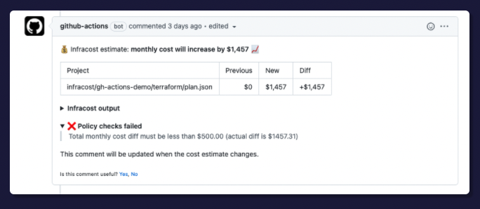

# Infracost GitHub Actions

This project provide a GitHub Action and examples for Infracost, so you can see cloud cost estimates for Terraform in pull requests 💰


## Quick start

The following steps assume a simple Terraform directory is being used, we recommend you use a more relevant [example](#examples) if required.

1. Retrieve your Infracost API key by running `infracost configure get api_key`. We recommend using your same API key in all environments. If you don't have one, [download Infracost](https://www.infracost.io/docs/#quick-start) and run `infracost register` to get a free API key.

2. [Create a repo secret](https://docs.github.com/en/actions/configuring-and-managing-workflows/creating-and-storing-encrypted-secrets#creating-encrypted-secrets-for-a-repository) called `INFRACOST_API_KEY` with your API key.

3. Create a new file in `.github/workflows/infracost.yml` in your repo with the following content.

 ```yaml
    # The GitHub Actions docs (https://docs.github.com/en/actions/reference/workflow-syntax-for-github-actions#on)
    # describe other options for 'on', 'pull_request' is a good default.
    on: [pull_request]
    jobs:
      infracost:
        name: Infracost
        runs-on: ubuntu-latest

        env:
          TF_ROOT: examples/terraform-project/code
          # If you're using Terraform Cloud/Enterprise and have variables stored on there
          # you can specify the following to automatically retrieve the variables:
          #   INFRACOST_TERRAFORM_CLOUD_TOKEN: ${{ secrets.TFC_TOKEN }}
          #   INFRACOST_TERRAFORM_CLOUD_HOST: app.terraform.io # Change this if you're using Terraform Enterprise

          steps:
            # Checkout the base branch of the pull request (e.g. main/master).
            - name: Checkout base branch
              uses: actions/checkout@v2
              with:
                ref: '${{ github.event.pull_request.base.ref }}'

            - name: Setup Infracost
              uses: infracost/actions/setup@v2
              # See https://github.com/infracost/actions/tree/master/setup for other inputs
              with:
                api-key: ${{ secrets.INFRACOST_API_KEY }}

            # Generate Infracost JSON file as the baseline.
            - name: Generate Infracost cost estimate baseline
              run: |
                infracost breakdown --path=${TF_ROOT} \
                                    --format=json \
                                    --out-file=/tmp/infracost-base.json

            # Checkout the current PR branch so we can create a diff.
            - name: Checkout PR branch
              uses: actions/checkout@v2

            # Generate an Infracost diff and save it to a JSON file.
            - name: Generate Infracost diff
              run: |
                infracost diff --path=${TF_ROOT} \
                                    --format=json \
                                    --compare-to=/tmp/infracost-base.json \
                                    --out-file=/tmp/infracost.json

            # Posts a comment to the PR using the 'update' behavior.
            # This creates a single comment and updates it. The "quietest" option.
            # The other valid behaviors are:
            #   delete-and-new - Delete previous comments and create a new one.
            #   hide-and-new - Minimize previous comments and create a new one.
            #   new - Create a new cost estimate comment on every push.
            # See https://www.infracost.io/docs/features/cli_commands/#comment-on-pull-requests for other options.
            - name: Post Infracost comment
              run: |
                  infracost comment github --path=/tmp/infracost.json \
                                           --repo=$GITHUB_REPOSITORY \
                                           --github-token=${{github.token}} \
                                           --pull-request=${{github.event.pull_request.number}} \
                                           --behavior=update
 ```

5. 🎉 That's it! Send a new pull request to change something in Terraform that costs money. You should see a pull request comment that gets updated, e.g. the 📉 and 📈 emojis will update as changes are pushed!

    If there are issues, check the GitHub Actions logs and [this page](https://www.infracost.io/docs/troubleshooting/).

6. Follow [the docs](https://www.infracost.io/usage-file) if you'd also like to show cost for of usage-based resources such as AWS Lambda or S3. The usage for these resources are fetched from CloudWatch/cloud APIs and used to calculate an estimate.

### Troubleshooting

#### Permissions issue

If you receive an error when running the `infracost comment` command in your pipeline, it's probably related to `${{ github.token }}`. This is the default GitHub token available to actions and is used to post comments. The default [token permissions](https://docs.github.com/en/actions/learn-github-actions/workflow-syntax-for-github-actions#permissions) work fine but `pull-requests: write` is required if you need to customize these. If you are using SAML single sign-on, you must first [authorize the token](https://docs.github.com/en/enterprise-cloud@latest/authentication/authenticating-with-saml-single-sign-on/authorizing-a-personal-access-token-for-use-with-saml-single-sign-on).

## Examples

The [examples](examples) directory demonstrates how these actions can be used for different projects. They all work by using the default Infracost CLI option that parses HCL, thus a Terraform plan JSON is not needed.
  - [Terraform/Terragrunt projects (single or multi)](examples/terraform-project): a repository containing one or more (e.g. mono repos) Terraform or Terragrunt projects
  - [Multi-projects using a config file](examples/multi-project-config-file): repository containing multiple Terraform projects that need different inputs, i.e. variable files or Terraform workspaces
  - [Private Terraform module](examples/private-terraform-module): a Terraform project using a private Terraform module
  - [Slack](examples/slack): send cost estimates to Slack

For advanced use cases where the estimate needs to be generated from Terraform plan JSON files, see the [plan JSON examples here](examples#plan-json-examples).

### Cost policies

Infracost policies enable centralized teams, who are often helping others with cloud costs, to provide advice before resources are launched, setup guardrails, and prevent human error. Follow [our docs](https://www.infracost.io/docs/features/cost_policies/) to use Infracost's native support for Open Policy Agent (OPA) policies. This enables you to see passing/failing policies in Infracost pull request comments (shown below) without having to install anything else.



If you use HashiCorp Sentinel, follow [our example](examples/sentinel) to output the policy pass/fail results into CI/CD logs.

## Contributing

Issues and pull requests are welcome! For development details, see the [contributing](CONTRIBUTING.md) guide. For major changes, including interface changes, please open an issue first to discuss what you would like to change. [Join our community Slack channel](https://www.infracost.io/community-chat), we are a friendly bunch and happy to help you get started :)

## License

[Apache License 2.0](https://choosealicense.com/licenses/apache-2.0/)
