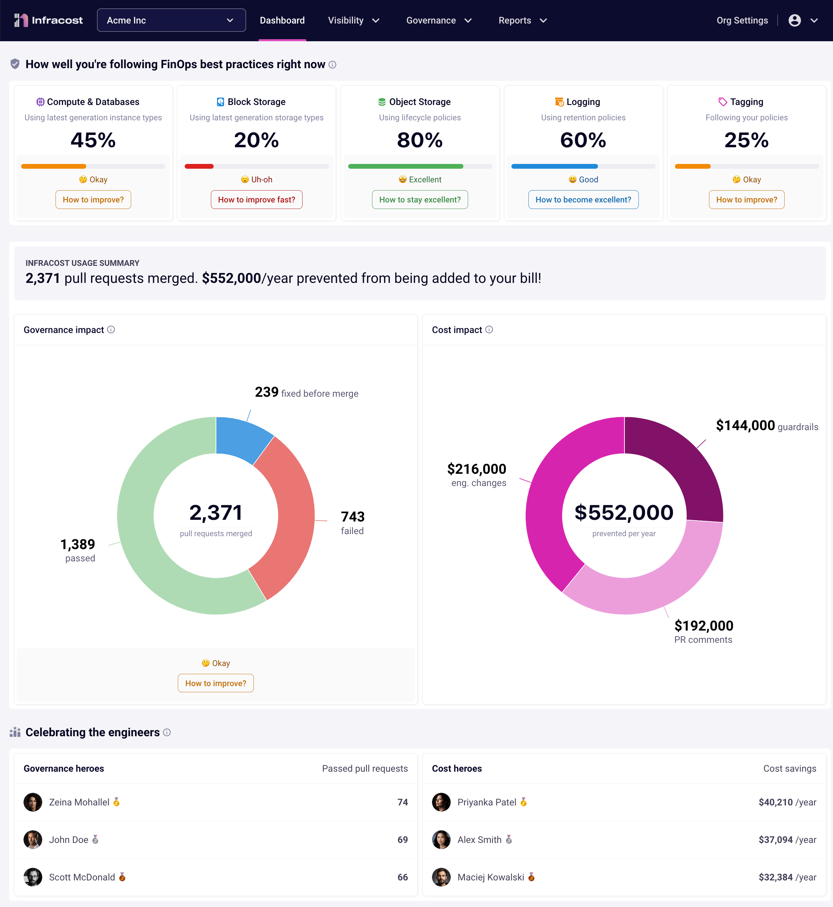

# Infracost GitHub Actions

### Try the GitHub App
👉👉 We recommend using the [**free Infracost GitHub App**](https://www.infracost.io/docs/integrations/github_app/) as it's much simpler to setup and faster to run

---

This GitHub Action runs Infracost so you can see cloud cost estimates and FinOps best practices for Terraform in pull requests 💰


## Quick start

1. If you haven't done so already, [download Infracost](https://www.infracost.io/docs/#quick-start) and run `infracost auth login` to get a free API key.

2. Retrieve your Infracost API key by running `infracost configure get api_key`.

3. [Create a repo secret](https://docs.github.com/en/actions/configuring-and-managing-workflows/creating-and-storing-encrypted-secrets#creating-encrypted-secrets-for-a-repository) called `INFRACOST_API_KEY` with your API key.

4. Create a new file in `.github/workflows/infracost.yml` in your repo with the following content.

```yaml
# Infracost runs on pull requests (PR) and posts PR comments.
# If you use Infracost Cloud, Infracost also runs on main/master branch pushes so the dashboard is updated.
# The GitHub Action docs (https://docs.github.com/en/actions/using-workflows/events-that-trigger-workflows) describe other trigger options.
on:
  pull_request:
    types: [opened, synchronize, closed]
  push:
    branches:
      - main
      - master

env:
  # If you use private modules you'll need this env variable to use
  # the same ssh-agent socket value across all jobs & steps.
  SSH_AUTH_SOCK: /tmp/ssh_agent.sock
jobs:
  # This stage runs the Infracost CLI and posts PR comments.
  # It also updates PR comments when the PR is updated (synchronize event).
  infracost-pull-request-checks:
    name: Infracost Pull Request Checks
    if: github.event_name == 'pull_request' && (github.event.action == 'opened' || github.event.action == 'synchronize')
    runs-on: ubuntu-latest
    permissions:
      contents: read
      pull-requests: write # Required to post comments
    # env:
      # If you store Terraform variables or modules in a 3rd party such as TFC or Spacelift,
      # specify the following so Infracost can automatically retrieve them.
      # See https://www.infracost.io/docs/features/terraform_modules/#registry-modules for details.
      #   INFRACOST_TERRAFORM_CLOUD_TOKEN: ${{ secrets.TFC_TOKEN }}
      #   INFRACOST_TERRAFORM_CLOUD_HOST: app.terraform.io
    steps:
      # If you use private modules, add an environment variable or secret
      # called GIT_SSH_KEY with your private key, so Infracost CLI can access
      # private repositories (similar to how Terraform/Terragrunt does).
      # - name: add GIT_SSH_KEY
      #   run: |
      #     ssh-agent -a $SSH_AUTH_SOCK
      #     mkdir -p ~/.ssh
      #     echo "${{ secrets.GIT_SSH_KEY }}" | tr -d '\r' | ssh-add -
      #     ssh-keyscan github.com >> ~/.ssh/known_hosts

      - name: Setup Infracost
        uses: infracost/actions/setup@v2
        # See https://github.com/infracost/actions/tree/master/setup for other inputs
        # If you can't use this action, use Docker image infracost/infracost:ci-0.10
        with:
          api-key: ${{ secrets.INFRACOST_API_KEY }}

      # Checkout the base branch of the pull request (e.g. main/master).
      - name: Checkout base branch
        uses: actions/checkout@v4
        with:
          ref: '${{ github.event.pull_request.base.ref }}'

      # Generate Infracost JSON file as the baseline.
      - name: Generate Infracost cost estimate baseline
        run: |
          infracost breakdown --path=. \
                              --format=json \
                              --out-file=/tmp/infracost-base.json

      # Checkout the current PR branch so we can create a diff.
      - name: Checkout PR branch
        uses: actions/checkout@v4

      # Generate an Infracost diff and save it to a JSON file.
      - name: Generate Infracost diff
        run: |
          infracost diff --path=. \
                          --format=json \
                          --compare-to=/tmp/infracost-base.json \
                          --out-file=/tmp/infracost.json

      # Posts a comment to the PR using the 'update' behavior.
      # This creates a single comment and updates it. The "quietest" option.
      # The other valid behaviors are:
      #   delete-and-new - Delete previous comments and create a new one.
      #   hide-and-new - Minimize previous comments and create a new one.
      #   new - Create a new cost estimate comment on every push.
      # See https://www.infracost.io/docs/features/cli_commands/#comment-on-pull-requests for other options.
      - name: Post Infracost comment
        run: |
            infracost comment github --path=/tmp/infracost.json \
                                     --repo=$GITHUB_REPOSITORY \
                                     --github-token=${{ github.token }} \
                                     --pull-request=${{ github.event.pull_request.number }} \
                                     --behavior=update

  # Run Infracost on default branch and update Infracost Cloud
  infracost-default-branch-update:
    # If you use private modules, or store Terraform variables or modules in a 3rd party
    # such as TFC or Spacelift, include the same steps/variables as the infracost-pull-request-checks job
    name: Infracost Default Branch Update
    if: github.event_name == 'push' && (github.ref_name == 'main' || github.ref_name == 'master')
    runs-on: ubuntu-latest
    steps:
      - name: Setup Infracost
        uses: infracost/actions/setup@v2
        with:
          api-key: ${{ secrets.INFRACOST_API_KEY }}

      - name: Checkout main/master branch
        uses: actions/checkout@v4

      - name: Run Infracost on default branch and update Infracost Cloud
        run: |
          infracost breakdown --path=. \
                    --format=json \
                    --out-file=infracost.json

          infracost upload --path=infracost.json || echo "Always pass main branch runs even if there are policy failures"

  # Update PR status in Infracost Cloud
  infracost-pull-request-status-update:
    name: Infracost PR Status Update
    if: github.event_name == 'pull_request' && github.event.action == 'closed'
    runs-on: ubuntu-latest
    steps:
    - name: Infracost PR Status Update
      run: |
        PR_STATUS="MERGED"
        if [[ ${{ github.event.pull_request.merged }} = false ]]; then PR_STATUS="CLOSED"; fi

        echo "Updating status of ${{ github.event.pull_request.html_url }} to $PR_STATUS"
        curl -i \
          --request POST \
          --header "Content-Type: application/json" \
          --header "X-API-Key: $INFRACOST_API_KEY" \
          --data "{ \"query\": \"mutation {updatePullRequestStatus( url: \\\"${{ github.event.pull_request.html_url }}\\\", status: $PR_STATUS )}\" }" \
          "https://dashboard.api.infracost.io/graphql";
      env:
        INFRACOST_API_KEY: ${{ secrets.INFRACOST_API_KEY }}
```

5. Test the integration using the following steps:

    1. In your infra-as-code repo, create a new branch "infracost_test".
    2. In the test branch, add a new file called `infracost_test.tf` at the repo root with the following example Terraform code.
        <details><summary>Example AWS Terraform code</summary>

        ```hcl
        provider "aws" {
          region                      = "us-east-1"
          skip_credentials_validation = true
          skip_requesting_account_id  = true
          access_key                  = "mock_access_key"
          secret_key                  = "mock_secret_key"
        }

        resource "aws_instance" "my_web_app" {
          ami           = "ami-005e54dee72cc1d00"

          instance_type = "m3.xlarge" # <<<<<<<<<< Try changing this to m5.xlarge to compare the costs

          tags = {
            Environment = "production"
            Service     = "web-app"
          }

          root_block_device {
            volume_size = 1000 # <<<<<<<<<< Try adding volume_type="gp3" to compare costs
          }
        }

        resource "aws_lambda_function" "my_hello_world" {
          runtime       = "nodejs12.x"
          handler       = "exports.test"
          image_uri     = "test"
          function_name = "test"
          role          = "arn:aws:ec2:us-east-1:123123123123:instance/i-1231231231"

          memory_size = 512
          tags = {
            Environment = "Prod"
          }
        }
        ```

        In the above example, the Infracost pull request comment points out that:
        1. The `root_block_device` defaults to AWS `gp2` since `volume_type` has not been specified. You should consider using `gp3` as it enables you to define performance independent of storage capacity, while providing up to 20% lower price per GB.
        2. Also, the `m3` instance type is previous generation and should be upgraded to `m5` since that gives you a 27% saving for a more performant machine.

        </details>

        <details><summary>Example Azure Terraform code</summary>

        ```hcl
        provider "azurerm" {
          skip_provider_registration = true
          features {}
        }

        resource "azurerm_linux_virtual_machine" "my_linux_vm" {
          location            = "eastus"
          name                = "test"
          resource_group_name = "test"
          admin_username      = "testuser"
          admin_password      = "Testpa5s"

          size = "Standard_F16s" # <<<<<<<<<< Try changing this to Standard_F16s_v2 to compare the costs

          tags = {
            Environment = "production"
            Service     = "web-app"
          }

          os_disk {
            caching              = "ReadWrite"
            storage_account_type = "Standard_LRS"
          }

          network_interface_ids = [
            "/subscriptions/123/resourceGroups/testrg/providers/Microsoft.Network/networkInterfaces/testnic",
          ]

          source_image_reference {
            publisher = "Canonical"
            offer     = "UbuntuServer"
            sku       = "16.04-LTS"
            version   = "latest"
          }
        }

        resource "azurerm_service_plan" "my_app_service" {
          location            = "eastus"
          name                = "test"
          resource_group_name = "test_resource_group"
          os_type             = "Windows"

          sku_name     = "P1v2"
          worker_count = 4 # <<<<<<<<<< Try changing this to 8 to compare the costs

          tags = {
            Environment = "Prod"
            Service     = "web-app"
          }
        }

        resource "azurerm_linux_function_app" "my_function" {
          location                   = "eastus"
          name                       = "test"
          resource_group_name        = "test"
          service_plan_id            = "/subscriptions/123/resourceGroups/testrg/providers/Microsoft.Web/serverFarms/serverFarmValue"
          storage_account_name       = "test"
          storage_account_access_key = "test"
          site_config {}

          tags = {
            Environment = "Prod"
          }
        }
        ```

        In the above example, the Infracost pull request comment points out that:
        1. The `Standard_F16s` instance type is previous generation and should be upgraded to `Standard_F16s_v2`, since that gives you a more performant machine at a lower cost.
        2. The App Service plan SKU name should be upgraded to a v3 plan, such as `P0v3`, since that gives you more performance and is eligible for savings plans and reserved instance pricing, opening opportunities for major savings.

        </details>

        <details><summary>Example Google Terraform code</summary>

        ```hcl
        provider "google" {
          region  = "us-central1"
          project = "test"
        }

        resource "google_compute_instance" "my_instance" {
          zone = "us-central1-a"
          name = "test"

          machine_type = "n1-standard-16" # <<<<<<<<<< Try changing this to n1-standard-32 to compare the costs
          network_interface {
            network = "default"
            access_config {}
          }

          boot_disk {
            initialize_params {
              image = "debian-cloud/debian-9"
            }
          }

          scheduling {
            preemptible = true
          }

          guest_accelerator {
            type  = "nvidia-tesla-t4" # <<<<<<<<<< Try changing this to nvidia-tesla-p4 to compare the costs
            count = 4
          }

          labels = {
            environment = "production"
            service     = "web-app"
          }
        }

        resource "google_cloudfunctions_function" "my_function" {
          runtime             = "nodejs20"
          name                = "test"
          available_memory_mb = 512

          labels = {
            environment = "Prod"
          }
        }
        ```

        In the above example, the Infracost pull request comment points out that the `n1-standard-16` instance type is previous generation and should be upgraded to something like `n2-standard-16` as that gives you a more performant machine.

        </details>
    3. Commit and push the change.
    4. Send a pull request from the test branch into main/master (don't worry we won't merge it!).
    5. 🎉 That's it! You should see a pull request comment showing the cost estimate as well as FinOps best practices that could be considered.
    6. Feel free to change other things in the `infracost_test.tf` file. The pull request comment gets updated when new changes are pushed, e.g. the 📉 and 📈 emojis will update when costs decrease or increase. Close the pull request when you are done testing.

6. [Infracost Cloud](https://dashboard.infracost.io) is our SaaS product that builds on top of Infracost open source. It enables team leads, managers and FinOps practitioners to setup [tagging policies](https://www.infracost.io/docs/infracost_cloud/tagging_policies/), [guardrails](https://www.infracost.io/docs/infracost_cloud/guardrails/) and [best practices](https://www.infracost.io/docs/infracost_cloud/cost_policies/) to help guide the team. For example, you can check for required tag keys/values, or suggest switching AWS gp2 volumes to gp3 as they are more performant and cheaper.

    If you **do not** want to use [Infracost Cloud](https://dashboard.infracost.io), go to Org Settings and disable the dashboard. This causes the CLI not to send its JSON output to your dashboard; the JSON does not contain any cloud credentials or secrets, see the [FAQ](https://infracost.io/docs/faq/) for more information.

    

## Troubleshooting

If you run into any issues, check the GitHub Action logs and the following steps. You can also join our [community Slack channel](https://www.infracost.io/community-chat), we'll help you very quickly 😄

### Permissions issue

If you receive an error when running the `infracost comment` command in your pipeline, it's probably related to `${{ github.token }}`. This is the default GitHub token available to actions and is used to post comments. The default [token permissions](https://docs.github.com/en/actions/learn-github-actions/workflow-syntax-for-github-actions#permissions) are read-only by default and `pull-requests: write` is required. If you are using SAML single sign-on, you must first [authorize the token](https://docs.github.com/en/enterprise-cloud@latest/authentication/authenticating-with-saml-single-sign-on/authorizing-a-personal-access-token-for-use-with-saml-single-sign-on).

#### The `add GIT_SSH_KEY` step fails

If you are using private modules and receive a `option requires an argument -- a` error in the `add GIT_SSH_KEY` step:
1. Make sure you have the following set in your workflow `SSH_AUTH_SOCK`:
    ```yml
    env:
      SSH_AUTH_SOCK: /tmp/ssh_agent.sock
    ```
2. Try changing the `ssh-agent -a $SSH_AUTH_SOCK` line to the following:
    ```yml
    ssh-agent -a "${{ env.SSH_AUTH_SOCK }}"
    ```

## Contributing

Issues and pull requests are welcome! For major changes, including interface changes, please open an issue first to discuss what you would like to change. [Join our community Slack channel](https://www.infracost.io/community-chat), we are a friendly bunch and happy to help you get started :)

## License

[Apache License 2.0](https://choosealicense.com/licenses/apache-2.0/)
